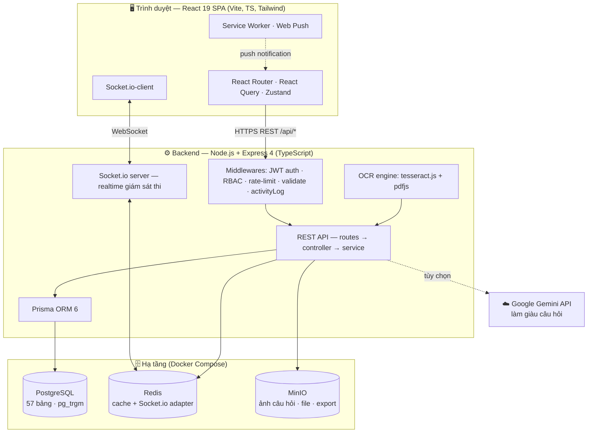
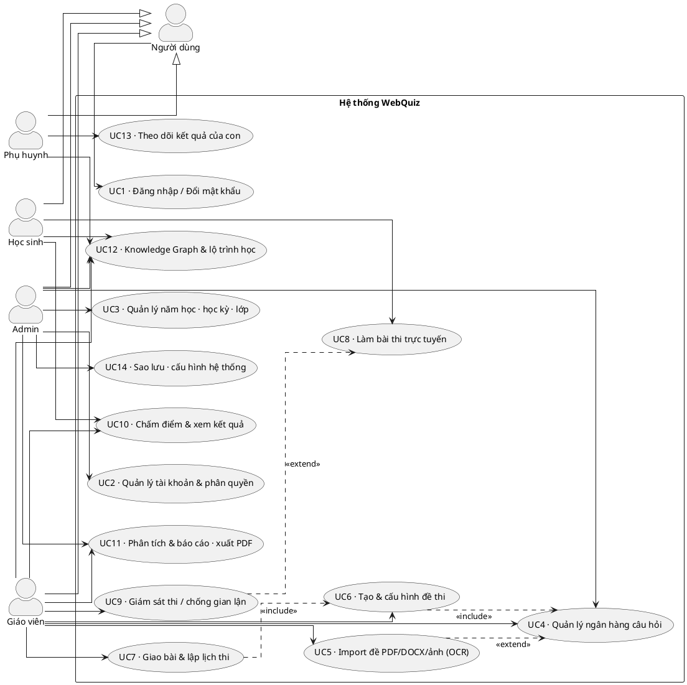
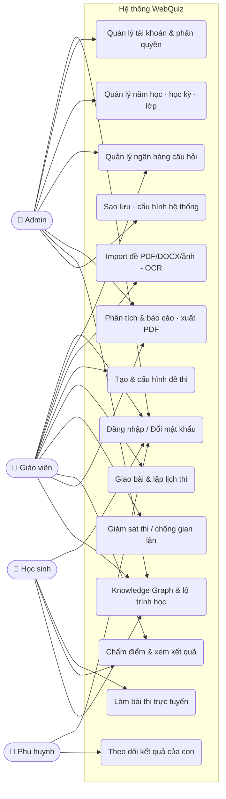
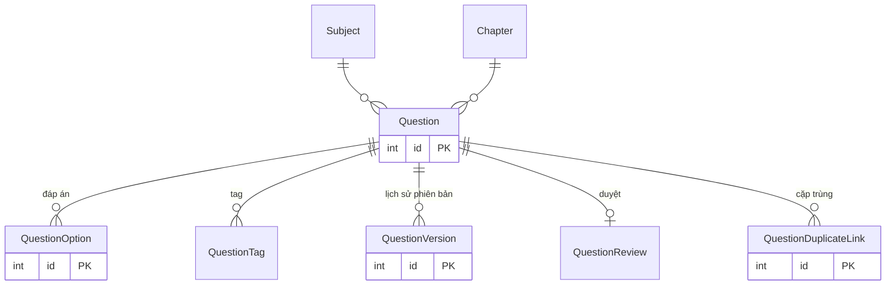
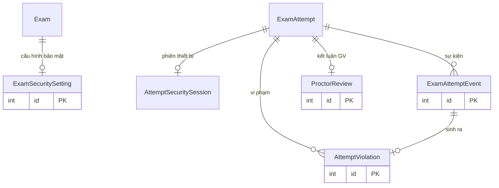
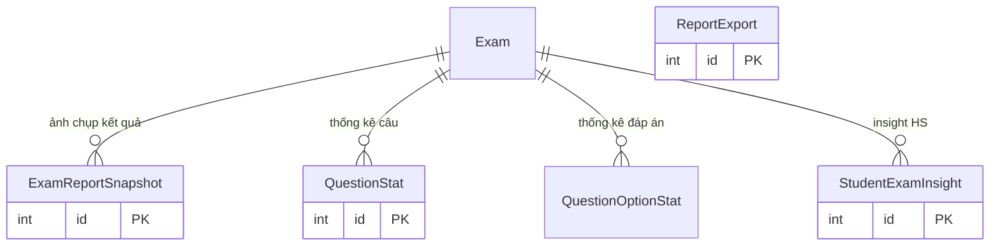
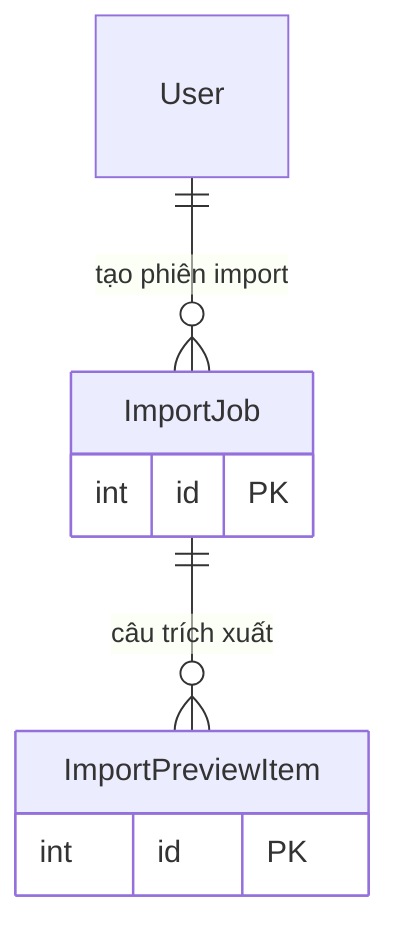
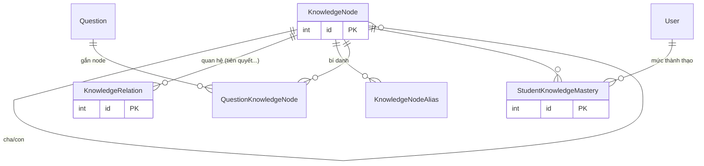
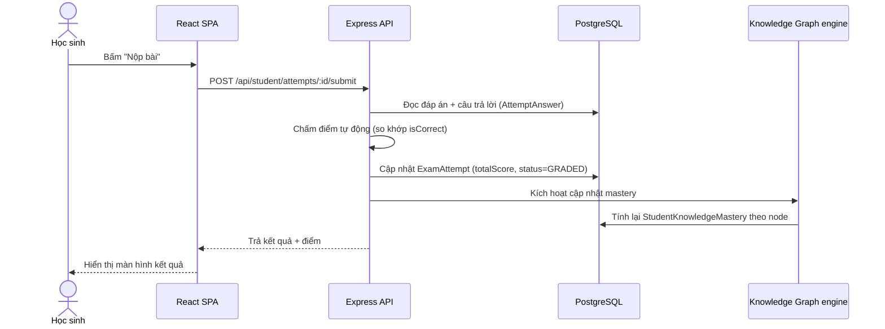
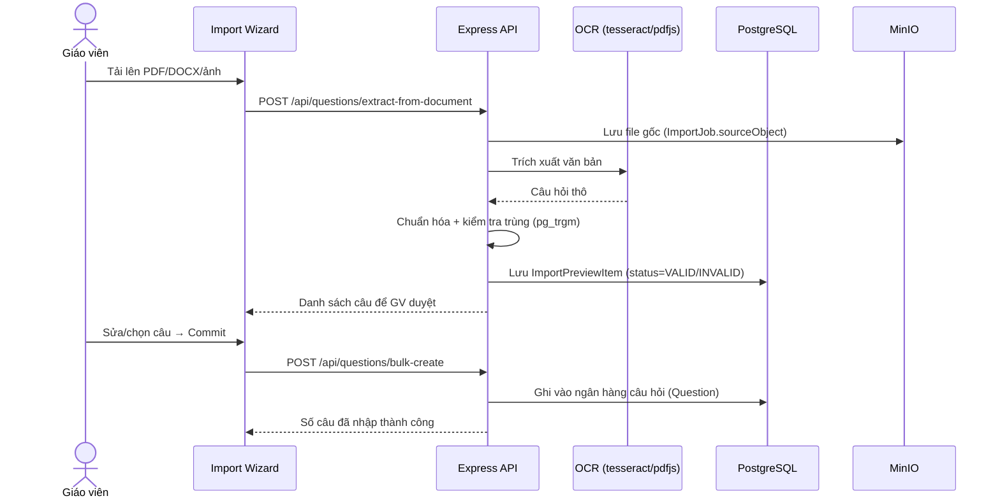

# Phụ lục Báo cáo — Sơ đồ & Bảng API (WebQuiz)

> Sinh trực tiếp từ mã nguồn (`prisma/schema.prisma` + 21 file `*.routes.ts`).
> Tất cả sơ đồ viết bằng **Mermaid** — dán vào https://mermaid.live để xuất ảnh PNG/SVG chèn vào Word.
> Số liệu thực tế: **57 bảng**, **32 enum**, **17 module backend**, ~**200+ endpoint**, **62 màn hình**, ~**69.000 dòng code**.

---

## A. SƠ ĐỒ KIẾN TRÚC HỆ THỐNG (Chương 4)



---

## B. SƠ ĐỒ USE CASE TỔNG QUÁT (Chương 3)

### Bản UML chuẩn (PlantUML) — *khuyến nghị dùng cho đồ án*

> Dán vào http://www.plantuml.com/plantuml hoặc cài extension **PlantUML** trong VS Code (Alt+D để xem trước → Export PNG/SVG).
> Lưu ý: 4 vai trò đều **kế thừa** actor "Người dùng" (đường tam giác) nên dùng chung use case *Đăng nhập / Đổi mật khẩu*.



**Giải thích quan hệ include/extend:**
- `UC6 ⟶ UC4` (**include**): tạo đề thi luôn cần lấy câu từ ngân hàng câu hỏi.
- `UC7 ⟶ UC6` (**include**): muốn giao bài/lập lịch thì phải có đề đã tạo.
- `UC5 ⟶ UC4` (**extend**): import OCR là cách *mở rộng* để bổ sung câu vào ngân hàng (tùy chọn).
- `UC9 ⟶ UC8` (**extend**): cơ chế giám sát/ghi nhận vi phạm *mở rộng* trong lúc học sinh làm bài.

### Bản Mermaid (thay thế nhanh nếu không cài được PlantUML)



> Đặc tả chi tiết (tác nhân – tiền điều kiện – luồng chính – luồng phụ – hậu điều kiện) nên viết cho 5 use case quan trọng: **Đăng nhập, Tạo đề thi, Làm bài thi, Import đề bằng OCR, Xem phân tích kết quả**.

---

## C. SƠ ĐỒ ERD (Chương 4) — tách theo cụm cho dễ đọc

> 57 bảng vẽ chung 1 hình sẽ rối. Tách thành 8 cụm theo nghiệp vụ. Mỗi cụm chỉ ghi khóa chính + vài cột tiêu biểu.

### Cụm 1 — Người dùng & Học vụ

```mermaid
erDiagram
    User ||--o| StudentProfile : "hồ sơ HS"
    User ||--o| ParentProfile : "hồ sơ PH"
    ParentProfile ||--o{ StudentProfile : "có con"
    AcademicYear ||--o{ Semester : "gồm"
    Semester ||--o{ Class : "có lớp"
    User ||--o{ Class : "GV chủ nhiệm"
    Subject ||--o{ Class : "môn"
    Class ||--o{ ClassStudent : "ghi danh"
    User ||--o{ ClassStudent : "là HS"
    Class ||--o{ StudentProfile : "lớp chủ nhiệm"
    Subject ||--o{ Chapter : "chương"

    User { int id PK }
    StudentProfile { string studentCode PK }
    ParentProfile { string parentCode PK }
    AcademicYear { int id PK }
    Semester { int id PK }
    Class { int id PK }
    Subject { int id PK }
    Chapter { int id PK }
```

### Cụm 2 — Ngân hàng câu hỏi



### Cụm 3 — Đề thi & Làm bài

```mermaid
erDiagram
    Exam ||--o{ ExamQuestion : "câu hỏi"
    Question ||--o{ ExamQuestion : ""
    Exam ||--o{ ExamSchedule : "lịch"
    Exam ||--o{ ExamAssignment : "giao lớp"
    Class ||--o{ ExamAssignment : ""
    Exam ||--o{ ExamAttempt : "lượt làm"
    User ||--o{ ExamAttempt : "HS làm"
    ExamAttempt ||--o{ AttemptAnswer : "câu trả lời"
    Question ||--o{ AttemptAnswer : ""

    Exam { int id PK }
    ExamAttempt { int id PK }
    AttemptAnswer { int id PK }
```

### Cụm 4 — Giám sát thi / Chống gian lận



### Cụm 5 — Phân tích & Báo cáo (snapshot cache)



### Cụm 6 — Import & OCR



### Cụm 7 — Knowledge Graph



### Cụm 8 — Lớp học (LMS) & Thảo luận

```mermaid
erDiagram
    Class ||--o{ ClassSection : "chương mục"
    ClassSection ||--o{ ClassResource : "tài nguyên"
    ClassSection ||--o{ ClassActivity : "hoạt động"
    ClassActivity ||--o{ ClassSubmission : "bài nộp"
    ClassActivity ||--o{ ClassForumPost : "diễn đàn"
    ClassActivity ||--o{ ClassAttendanceRecord : "điểm danh"
    Class ||--o{ ClassTimetableSlot : "thời khóa biểu"
    Class ||--o{ Discussion : "thông báo/thảo luận"
    Discussion ||--o{ DiscussionReply : "phản hồi"

    ClassActivity { int id PK }
    ClassSubmission { int id PK }
    Discussion { int id PK }
```

> Các bảng hệ thống còn lại (không cần ERD riêng): `Notification`, `ActivityLog`, `SystemConfig`, `Backup`, `WebPushSubscription`, `ExamSecurityPolicyTemplate`, `ClassMemberRoleAssignment`, `ClassCompletion`, `ClassActivityLog`, `DiscussionAttachment`.

---

## D. SƠ ĐỒ TUẦN TỰ (Sequence — Chương 4/5)

### D1. Học sinh nộp bài → chấm tự động → cập nhật mastery



### D2. Import đề từ PDF/ảnh → OCR → duyệt → tạo câu hỏi



---

## E. BẢNG API (Chương 4) — nhóm theo module

> Mọi API đều có tiền tố `/api`. Cột **Quyền**: 🔓 = đã đăng nhập; vai trò cụ thể ghi rõ. Tổng cộng **21 nhóm route**.

### E1. Xác thực — `/api/auth`
| Method | Path | Mô tả | Quyền |
|---|---|---|---|
| POST | `/login` | Đăng nhập, cấp JWT | 🔓 công khai |
| POST | `/logout` | Đăng xuất | 🔓 |
| POST | `/refresh` | Làm mới access token | 🔓 công khai |

### E2. Tài khoản cá nhân — `/api/users`
| Method | Path | Mô tả | Quyền |
|---|---|---|---|
| GET | `/me` | Lấy thông tin bản thân | 🔓 |
| PUT | `/me` | Cập nhật hồ sơ | 🔓 |
| PUT | `/me/password` | Đổi mật khẩu | 🔓 |
| POST | `/me/avatar` | Tải ảnh đại diện | 🔓 |

### E3. Quản trị tài khoản — `/api/admin/users` *(Admin)*
| Method | Path | Mô tả |
|---|---|---|
| GET | `/` · `/roles` · `/import-template` | Danh sách / DS vai trò / tải file mẫu import |
| POST | `/` · `/:id/reset-password` · `/import` | Tạo / reset mật khẩu / import hàng loạt |
| PUT | `/:id` · `/:id/role` | Cập nhật thông tin / đổi vai trò |
| DELETE | `/:id` | Xóa tài khoản |

### E4. Ngân hàng câu hỏi — `/api/questions` *(GV/Admin)*
| Method | Path | Mô tả |
|---|---|---|
| GET | `/` · `/:id` · `/images/:key` | Danh sách / chi tiết / phục vụ ảnh |
| POST | `/` · `/:id/tags` · `/:id/versions/:versionId/restore` | Tạo / gắn tag / khôi phục phiên bản |
| PUT | `/:id` | Cập nhật câu hỏi (sinh QuestionVersion) |
| DELETE | `/:id` · `/:id/tags/:tagId` | Xóa câu / gỡ tag |
| POST | `/import` · `/import-zip` · `/extract-from-document` | Import Excel / ZIP ảnh / trích xuất DOCX-PDF (OCR) |
| POST | `/bulk-create` · `/bulk-update` · `/bulk-delete` | Thao tác hàng loạt |
| POST | `/ai-suggest` · `/export-gift` · `/images` | Gợi ý AI / xuất GIFT / upload ảnh |
| GET | `/import-template` · `/document-import-template` · `/zip-import-template` | Tải file mẫu |

### E5. Đề thi — `/api/exams` *(GV/Admin)*
| Method | Path | Mô tả |
|---|---|---|
| GET | `/` · `/:id` | Danh sách / chi tiết đề |
| POST | `/` · `/:id/questions` · `/:id/schedule` · `/:id/assign` | Tạo / thêm câu / lập lịch / giao lớp |
| PUT | `/:id` · `/:id/publish` · `/:id/security-settings` | Sửa / phát hành / cấu hình bảo mật |
| DELETE | `/:id` · `/:id/attempts/:attemptId` | Xóa đề / xóa lượt làm |
| GET | `/:id/assignments` · `/:id/monitoring` · `/:id/proctoring/live` | Lớp được giao / giám sát realtime |
| GET | `/:id/reports` · `/:id/attempts/:attemptId/evidence` | Báo cáo điểm / hồ sơ bằng chứng |
| PUT | `/:id/attempts/:attemptId/review` · `/.../answers/:answerId/grade` | Kết luận proctor / chấm tay 1 câu |

### E6. Làm bài thi (Học sinh) — `/api/student`
| Method | Path | Mô tả |
|---|---|---|
| GET | `/exams` | Danh sách đề được giao |
| POST | `/exams/:id/precheck` · `/exams/:id/start` | Kiểm tra điều kiện (lobby) / bắt đầu thi |
| PUT | `/attempts/:id/save` | Tự lưu câu trả lời |
| POST | `/attempts/:id/submit` | Nộp bài (chấm tự động) |
| POST | `/attempts/:id/events` · `/events/batch` · `/security-session` · `/heartbeat` | Ghi sự kiện giám sát / phiên bảo mật / nhịp tim |
| GET | `/attempts` · `/attempts/:id/result` | Lịch sử / kết quả 1 lượt |

### E7. Phân tích đề thi (GV) — `/api/teacher`
| Method | Path | Mô tả |
|---|---|---|
| GET | `/exams/:id/analytics/summary` · `/questions` · `/students` · `/status` | Tổng quan / theo câu / theo HS / trạng thái |
| POST | `/exams/:id/analytics/recalculate` | Tính lại snapshot |
| GET | `/students/:studentId/knowledge-graph` · `/classes/:classId/knowledge-graph` · `/weak-nodes` | KG của HS / lớp / node yếu |
| POST | `/classes/:classId/knowledge-graph/practice` | Giao bộ luyện tập theo node yếu |

### E8. Knowledge Graph (Admin) — `/api/admin/knowledge-nodes`
| Method | Path | Mô tả |
|---|---|---|
| GET | `/` · `/:id/aliases` · `/relations` · `/quality` | Liệt kê node / bí danh / quan hệ / báo cáo chất lượng |
| POST | `/autogenerate` · `/recalculate` · `/relations` · `/relations/seed-part-of` · `/:id/aliases` · `/:id/merge` | Tự sinh / tính lại / tạo quan hệ / gộp node |
| PATCH | `/:id` | Sửa node |
| DELETE | `/:id` · `/relations/:id` · `/aliases/:aliasId` | Xóa node / quan hệ / bí danh |

### E9. Knowledge Graph (Học sinh) — `/api/student`
| Method | Path | Mô tả |
|---|---|---|
| GET | `/knowledge-graph` · `/recommendations` · `/path` | Sơ đồ tri thức / gợi ý / lộ trình học |
| POST | `/knowledge-graph/practice` | Sinh bộ luyện tập cá nhân hóa |

### E10. Phụ huynh — `/api/parent` *(Parent)*
| Method | Path | Mô tả |
|---|---|---|
| GET | `/children` · `/children/:id/results` · `/children/:id/dashboard` | DS con / kết quả / dashboard |
| GET | `/children/:id/knowledge-graph` · `/knowledge-graph/path` | KG & lộ trình học của con |

### E11. Các module còn lại (tóm tắt theo base path & số endpoint)
| Module | Base path | Số endpoint | Chức năng chính |
|---|---|---|---|
| Lớp học (LMS) | `/api/classes` | 33 | Lớp, chương mục, tài nguyên, hoạt động, bài nộp, điểm danh, hoàn thành |
| Thảo luận | `/api/discussions` | 10 | Thông báo, thảo luận, phản hồi, đính kèm |
| Thời khóa biểu | `/api/timetable` | 9 | Tiết học, môn, phòng, kiểm tra trùng lịch thi |
| Học vụ | `/api/admin/academic` | 8 | Năm học, học kỳ, môn, lớp |
| Hệ thống | `/api/admin/system` | 7 | Cấu hình, giám sát, sao lưu (backup) |
| Thông báo | `/api/notifications` | 5 | In-app + Web Push |
| Phân tích admin | `/api/admin` | — | Thống kê toàn hệ thống |
| Phân tích HS | `/api/student` | — | Dashboard học tập của HS |
| Chương trình | `/api` | 3 | Subject → Chapter (curriculum) |
| Chất lượng câu hỏi | `/api/questions` | — | Review queue, duplicate, quality flag |
| Import job | `/api/questions` | — | Theo dõi tiến trình import (poll) |
| AI | `/api/ai` | 1 | Sinh phương án nhiễu (matching distractor) |

---

## F. MA TRẬN PHÂN QUYỀN (RBAC) — Chương 4

| Nhóm chức năng | Admin | Giáo viên | Học sinh | Phụ huynh |
|---|:--:|:--:|:--:|:--:|
| Quản lý tài khoản & phân quyền | ✅ | — | — | — |
| Quản lý năm học / học kỳ / môn | ✅ | — | — | — |
| Quản lý lớp & nội dung lớp | ✅ | ✅ | xem | — |
| Ngân hàng câu hỏi & Import/OCR | ✅ | ✅ | — | — |
| Tạo / giao / lập lịch đề thi | ✅ | ✅ | — | — |
| Làm bài thi | — | — | ✅ | — |
| Giám sát thi & chấm tay | ✅ | ✅ | — | — |
| Phân tích & báo cáo đề thi | ✅ | ✅ | — | — |
| Knowledge Graph & lộ trình | ✅ (quản trị) | ✅ (lớp/HS) | ✅ (bản thân) | xem (của con) |
| Theo dõi kết quả của con | — | — | — | ✅ |
| Sao lưu & cấu hình hệ thống | ✅ | — | — | — |

---

### Ghi chú khi đưa vào báo cáo
- Mỗi sơ đồ/bảng phải **được đánh số** (Hình 4.1, Bảng 4.2…) và **được nhắc tới trong văn bản** trước khi xuất hiện.
- ERD nên dán **từng cụm** kèm 1–2 câu giải thích quan hệ chính, không dán cả 8 cụm liền nhau.
- Bảng API đầy đủ (toàn bộ ~200 endpoint) nên để ở **Phụ lục**; trong Chương 4 chỉ trích các module trọng tâm (E4–E9).
